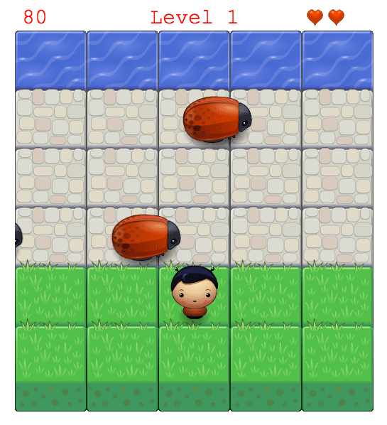

## Frogger

This game has a Player and Enemies (Bugs). The goal of the player is to reach the water, without colliding into any of the enemies. The player can move left, right, up and down. The player has 3 lives represented with 3 small hearst in the right upper corner of the canvas. The enemies move in varying speeds on the paved block portion of the screen.

20 points are gained once the player reaches the water then the player moves back to the start square. After every 100 points you move one level up where the enemies speed increases.

Once the player collides with an enemy, looses one life and the player moves back to the start square. After loosing the third life, the game is over.

### How to Start Game

1. Open `index.html`

### How to Play

1. Use arrow keys to control the palyer
2. Reach the water avoiding the enemies
3. Get 20 points if you reach the water
4. Gain 100 points to move up a level
4. Loose a life when colliding with an enemy
5. After loosing the 3rd life the game is over!

